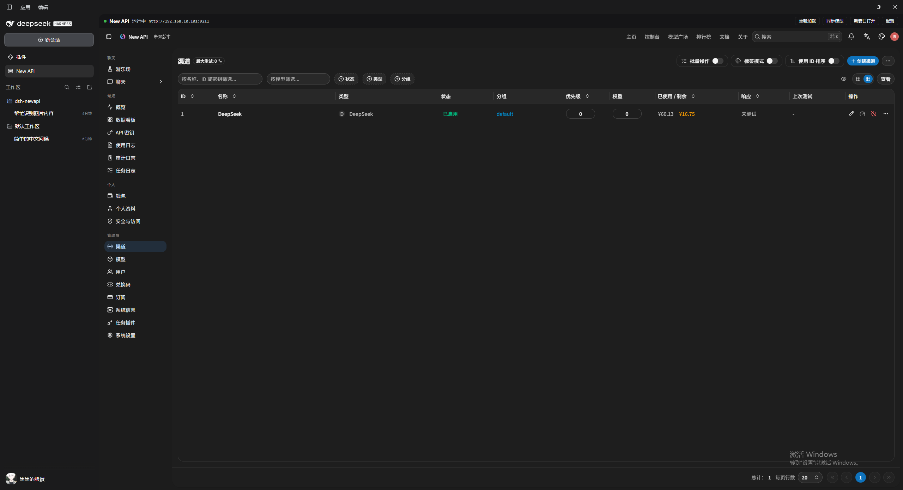
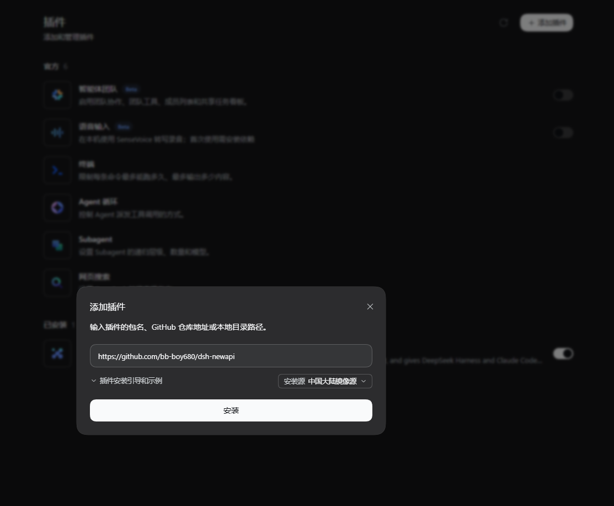

<p align="center">
  <a href="../README.md">English</a> · <a href="README.zh-CN.md">简体中文</a>
</p>

<h1 align="center">DSH New API</h1>

<p align="center">
  <strong>把 New API 装进 DeepSeek Harness —— 一个随 DSH 启动的本地网关。</strong><br>
  无需手动下载、启动、初始化 New API：插件托管它的进程、数据库和访问令牌，并把它的模型直接搬进 DSH 的模型选择器。<br>
  同一个端点再交给 Claude Code、Codex 或任何 OpenAI / Anthropic 兼容客户端。
</p>

<p align="center">
  
  
  
  
</p>

<p align="center">
  
  
  
  
  
</p>

<p align="center">
  <a href="https://github.com/bb-boy680/dsh-newapi">GitHub</a> ·
  <a href="https://github.com/bb-boy680/dsh-newapi/issues">Issues</a> ·
  <a href="https://github.com/QuantumNous/new-api">上游 New API</a>
</p>

<p align="center">
  
</p>
<p align="center">
  <em>侧边栏多了一个 <code>New API</code> 面板，控制台就在主区域里；顶栏是网关状态、地址和「重新加载 / 同步模型 / 新窗口打开 / 配置」。</em>
</p>

---

## 为什么需要它？

New API 很好用，但它需要你自己把它跑起来。

- **不用自己托管进程。** 装好插件，DSH 一启动，网关就在后台跑起来：二进制由插件下载并校验，SQLite 数据库、日志、访问令牌都放在 DSH 自己的数据目录里。
- **不用手工初始化。** 首次运行只需要在面板里填两个值（端口和 root 密码），插件会完成 `/api/setup`、登录、建令牌、读模型这一整套流程。
- **不用在多个客户端之间抄 key。** 网关自己发一个令牌，DSH、Claude Code、Codex、任何 OpenAI / Anthropic 兼容客户端都指向 `http://127.0.0.1:<端口>`。
- **模型直接出现在 DSH 里。** 插件把网关的模型列表写进 DSH 的模型配置（`llm-pi-ai` 路由 + 凭据引用），不需要重启，也不需要重新输 key。
- **首次安装之后不再联网。** 二进制按版本缓存并做 sha256 校验，第二次启动不碰网络。
- **连不上 GitHub 也能装。** 插件会自己找一个能用的出口：环境变量里的代理、Windows 的系统代理设置，实在没有就探测本机常见代理端口；也可以手动放一个二进制进去。
- **下载失败不再是死路。** 启动过程分阶段上报进度，失败会被归类成「网络 / 校验 / 端口 / 网关 / 超时」，面板给出原因、处理办法和「重试启动」。

## 功能

> [!TIP]
> 这不是 New API 的 fork，也不是它的包装脚本 —— 它是把 New API 当作 **DSH 的托管 sidecar** 来跑的一层集成：装二进制、拉起来、初始化、发布模型、嵌入控制台。

- **托管生命周期** —— 用 DSH 的 `subprocess` 服务启动网关子进程（`SQLITE_PATH` / `SESSION_SECRET` / `GIN_MODE=release` / `TRUSTED_PROXIES=none`），轮询 `/api/status` 确认就绪，插件卸载或改端口时干净地停掉它。
- **实例接管** —— 如果端口上已经有一个能响应 `/api/status` 的 New API（比如你自己手动跑的），插件直接接管它，绝不重复启动第二个。
- **二进制来源优先级** —— 数据目录里的 `new-api(.exe)` → 数据目录里的发行文件名 → 版本缓存 → 最后才联网下载。手放的二进制会被直接使用并报告它的 sha256；只有联网拿到的字节才必须通过官方校验清单。
- **自动发现网络出口** —— 按「环境变量 → Windows Internet Settings 注册表 → 直连失败后探测本机端口」的顺序解析代理，并且真的会用 `CONNECT` 隧道 / 绝对形式请求把它说出口；`NO_PROXY` / `ProxyOverride` 会被尊重，代理密码只用于握手、绝不进日志。
- **首次运行由面板决定** —— 端口和 root 密码在网关创建数据库之前收集；如果这个 DSH 里没有面板（比如纯命令行组合），在插件行上写 `rootPassword` 就跳过提问。
- **模型发布到 DSH** —— 把网关令牌写进凭据服务，把 `new-api` 路由写进 `llm-pi-ai` 设置，模型列表同步进模型选择器；之后在网关控制台里加渠道，点一下「同步模型」即可，不用重启 DSH。
- **思考等级可声明** —— `providerReasoningEfforts` 声明路由支持的档位（`off` / `low` / `medium` / `high` / `xhigh` / `max`），并强制 OpenAI 派发格式；留空表示「完全不声明」，适合上游会忽略该参数的部署。
- **图片输入按来源分级判定** —— 插件行的 `providerImageModels`（支持 `*` 与 `!` 排除）→ New API 控制台里的模型标签（`vision` / `vlm` / `多模态` / `视觉` …）→ DSH 已安装的模型目录（按 id 匹配）；都没描述到的模型走 `providerDefaultInput`。
- **上下文长度按模型解析** —— 目录里有这个模型就用它自己的上下文窗口和输出上限（取各来源里最小的那个）；被中转站改了名字的模型（网关叫 `deepseek-v4.1-flash`、目录里叫 `deepseek-flash`）直接取它对应目录 id 的数值，**第一次同步就有**；目录没描述、也没对上别名的模型会保留这个路由上已有的数值（也就是你在「设置 → 模型」里填的）；三者都没有才退回路由上的 `providerContextWindow` / `providerMaxTokens`。
- **控制台登录态桥接** —— 桌面壳的页面来自 `dsh-app://`，内嵌控制台属于跨站框架，浏览器的 `SameSite=Strict` cookie 保不住。插件在内网回环上起一个反向代理，由它以真人登录的那个账号持有一份网关会话，于是控制台刷新时不会掉回登录页。
- **失败可分类、可重试** —— 启动最多尝试 3 次（间隔 5s / 15s），仍然失败就把原因写进面板；修好之后点「重试启动」，不用去 Plugins 页把插件关了再开。
- **中英文界面** —— 面板文案走 DSH 的 locale 服务，`zh` 与 `en` 两套都在包里。
- **零运行时依赖** —— 插件本身不引入任何依赖，配置字段由代码直接读取校验，装插件不需要包管理器解析任何东西。

## 快速开始

> [!NOTE]
> 需要 DeepSeek Harness 桌面端（带 `webServer` 与 `subprocess` 服务），Node.js `^22.19` 或 `>=24`。

### 1. 安装插件

打开 DSH 的 **插件** 页 → **添加插件** → 填入仓库地址 → **安装**：

```text
https://github.com/bb-boy680/dsh-newapi
```

包名或本地目录路径也可以；本仓库的检出目录直接填路径同样能被识别。

<p align="center">
  
</p>
<p align="center">
  <em>「添加插件」支持包名、GitHub 仓库地址和本地目录路径三种来源。</em>
</p>

### 2. 完成首次运行配置

插件被启用后侧边栏会出现 **New API** 面板：

1. 首次运行时面板会先让你填 **端口号**（默认 `3000`）和 **root 密码**（8–128 个字符，请自行保存）。
2. 点「完成」。第一次安装会下载约 **128 MB** 的网关二进制，面板会显示下载源、已下载字节、速度和预计剩余时间。
3. 下载完成后做 sha256 校验、启动进程、初始化实例、创建访问令牌，然后直接进入 New API 控制台。

> [!IMPORTANT]
> 下载期间请保持 DSH 开着。刷新浏览器或离开这个页面不会中断下载，但关掉 DSH 会。

### 3. 在控制台里加一个上游渠道

嵌入的控制台就是 New API 自己的控制台（**渠道 → 新建渠道**），在这里添加上游服务和 key。加完之后回到面板点一次 **同步模型**，新模型立刻出现在 DSH 的模型选择器里。

### 4. 交给其他客户端

网关地址和令牌写在连接信息文件里（Windows 为 `%USERPROFILE%\.dsh\newapi\connection.json`，macOS / Linux 为 `~/.dsh/newapi/connection.json`，权限 `0600`）：

```json
{
  "port": 3000,
  "baseUrl": "http://127.0.0.1:3000",
  "openaiBaseUrl": "http://127.0.0.1:3000/v1",
  "anthropicBaseUrl": "http://127.0.0.1:3000",
  "modelsEndpoint": "http://127.0.0.1:3000/v1/models",
  "consoleUrl": "http://127.0.0.1:3000/",
  "lanBaseUrl": "http://192.168.1.10:3000",
  "lanConsoleUrl": "http://192.168.1.10:3000/",
  "token": "sk-...",
  "claudeCodeEnv": {
    "ANTHROPIC_BASE_URL": "http://127.0.0.1:3000",
    "ANTHROPIC_AUTH_TOKEN": "sk-..."
  },
  "models": ["deepseek-chat", "gpt-4o-mini"]
}
```

`lanBaseUrl` / `lanConsoleUrl` 只在这台机器确实有一个能打开的局域网地址时才会出现 —— 它们是为了让同一个网络里的手机或另一台电脑也能用。

同一份信息也会打印在日志里（`<数据目录>/dsh-newapi.log`）。

## 接到 Claude Code / Codex

网关同时说两套协议：OpenAI 兼容面在 `/v1`，Anthropic 兼容面在 `/v1/messages`。所以同一个网关可以同时喂给两边。

### Claude Code

```bash
# macOS / Linux
export ANTHROPIC_BASE_URL="http://127.0.0.1:3000"
export ANTHROPIC_AUTH_TOKEN="<connection.json 里的 token>"
claude
```

```powershell
# Windows PowerShell
$env:ANTHROPIC_BASE_URL = "http://127.0.0.1:3000"
$env:ANTHROPIC_AUTH_TOKEN = "<connection.json 里的 token>"
claude
```

`claudeCodeEnv` 字段就是这两行，可以直接复制。

### Codex / 任何 OpenAI 兼容客户端

`~/.codex/config.toml`：

```toml
model = "deepseek-chat"
model_provider = "newapi"

[model_providers.newapi]
name = "New API"
base_url = "http://127.0.0.1:3000/v1"
env_key = "NEW_API_KEY"
wire_api = "chat"
```

```bash
export NEW_API_KEY="<connection.json 里的 token>"
```

> [!TIP]
> `NEW_API_KEY` 不是随便取的：插件发布到 DSH 的模型路由用的就是这个名字（`providerApiKeyRef` 的默认值），DSH 和命令行客户端可以共用同一个环境变量。

其他客户端只需要两件事：**Base URL** `http://127.0.0.1:<端口>/v1`，以及 **API Key** = 令牌。想换模型、改倍率、看用量，都在网关控制台里做，客户端不用动。

## 工作原理

插件不会替你决定任何事，它只是一步步把网关从「不存在」变到「能用」：

```text
DSH 启动
   │
   ├── 1. 读配置      插件行 → 有效配置；未知键或类型不对直接拒绝加载
   │
   ├── 2. 首次运行    面板收集端口 + root 密码（或插件行的 rootPassword / binaryPath 跳过）
   │
   ├── 3. 找二进制    数据目录 → 版本缓存；都没有才联网
   │
   ├── 4. 解析出口    环境变量 → Windows 系统代理 → 直连失败后探测本机代理端口
   │
   ├── 5. 下载校验    流式下载 ~128 MB，对 checksums-<os>.txt 做 sha256 校验，缓存到 <DSH_HOME>/cache/newapi/<版本>/
   │
   ├── 6. 托管启动    端口已被既有的 New API 占用则接管，否则 subprocess 启动子进程并轮询 /api/status
   │
   ├── 7. 初始化      /api/setup → 登录 → 创建/复用令牌 → 读取模型列表 → 写 connection.json
   │
   ├── 8. 发布模型    令牌 → 凭据服务；模型与路由 → llm-pi-ai 设置（DSH 模型选择器立即可见）
   │
   └── 9. 控制台代理  回环反向代理持有网关会话，把控制台嵌进侧边栏
```

### 启动阶段与失败分类

面板读的是插件上报的阶段（`src/progress.js`），所以「没运行」永远不会是一句没有信息的话：

| 阶段 | 面板上看到的意思 |
| ---- | ---------------- |
| `idle` | 还没开始：首次运行在等表单 |
| `preparing` | 正在找本机已有的网关程序 / 解析网络出口 / 取校验清单 |
| `downloading` | 正在流式下载发行二进制（唯一带字节数的阶段） |
| `starting` | 子进程已拉起，正在轮询 `/api/status` |
| `provisioning` | 正在初始化实例、创建访问令牌 |
| `retrying` | 这一次失败了，下一次已排期 |
| `ready` | 网关可用，面板显示控制台 |
| `failed` | 尝试次数用尽，面板显示原因并提供「重试启动」 |

失败会被归类，面板据此给出不同的处理建议：

| 分类 | 典型原因 | 处理方向 |
| ---- | -------- | -------- |
| `network` | `fetch failed` / `ECONNREFUSED` / `ETIMEDOUT` / TLS / 代理拒绝 `CONNECT` | 设置 `HTTPS_PROXY` 后重启 DSH；换一条出口后点「重试启动」；或手动下载放到提示的路径里 |
| `checksum` | 下载内容与官方清单不一致 | 点「重试启动」重新下载；反复失败就在浏览器里下载后手放 |
| `port` | 端口附近 20 个端口都不可用 | 在「配置」里换端口，或改插件行的 `port` |
| `gateway` | 子进程启动后立刻退出 | 端口占用、数据目录不可写、杀软拦截；面板会带上子进程自己打印的说明 |
| `timeout` | 进程活着但 `/api/status` 一直不响应 | 防火墙拦截或首次启动仍在做数据库迁移，再等一次 |
| `unknown` | 没有匹配的特征 | 把日志发出来定位 |

## 配置项

配置写在插件行上（profile 的 `cordis.patch.yml` 里那份）。**未知键会直接让插件拒绝加载**，而不是被悄悄忽略 —— 打错一个字母就得到一个谁也没要求的网关，是最难查的一类问题。

| 键 | 类型 | 默认值 | 说明 |
| -- | ---- | ------ | ---- |
| `enabled` | boolean | `true` | 关掉后不启动任何东西 |
| `version` | string | `v1.0.0-rc.39` | 上游发行标签；`latest` 会在启动时问 GitHub API（只支持 GitHub 下载源） |
| `binaryPath` | string | — | 直接指定网关二进制，跳过查找与下载 |
| `port` | number | `3000` | 期望端口；被占用时在 20 个端口内顺延。面板首次运行时填的值优先 |
| `dataDir` | string | `<DSH_HOME>/newapi` | 数据库、日志、状态文件、连接信息的目录 |
| `dshHome` | string | `$DSH_HOME` 或 `~/.dsh` | DSH 主目录 |
| `downloadBaseUrl` | string | `https://github.com/QuantumNous/new-api/releases/download` | 发行下载前缀 |
| `rootUsername` | string | `root` | 管理员账号名 |
| `rootPassword` | string | — | 预设 root 密码；设置了就不再向面板提问，适合没有面板的组合 |
| `tokenName` | string | `dsh` | 网关里为 DSH 创建的令牌名 |
| `readyTimeoutMs` | number | `120000` | 等待 `/api/status` 的上限 |
| `publishProvider` | boolean | `true` | 是否把网关发布进 DSH 的模型配置 |
| `providerName` | string | `new-api` | 发布到 `llm-pi-ai` 的路由名 |
| `providerDisplayName` | string | `New API` | 模型选择器里显示的名字 |
| `providerApiKeyRef` | string | `NEW_API_KEY` | 令牌存放在凭据服务里的引用名 |
| `providerContextWindow` | number | `131072` | 目录没有描述该模型时的上下文窗口猜测值 |
| `providerMaxTokens` | number | `32768` | 同上，输出上限 |
| `providerReasoningEfforts` | string | `off,low,medium,high,xhigh,max` | 声明的思考档位；留空表示完全不声明 |
| `providerImageModels` | string | 空 | 声明支持图片输入的模型，支持 `*` 与 `!` 排除；优先级最高 |
| `providerModelAliases` | string | 空 | `网关模型id=目录模型id` 对，说明网关这个 id 其实是目录里的哪个模型；优先级高于插件内置的对照表 |
| `providerDefaultInput` | string | `text,image` | 没有任何来源描述该模型时它接受的输入类型 |

示例：把网关固定在一个已有实例上，并且不向面板提问：

```yaml
- id: newapi
  name: 'dsh-newapi'
  config:
    port: 3080
    rootPassword: 'change-me-please'
    version: v1.0.0-rc.39
```

示例：上游大多是文本模型，不要声明思考档位：

```yaml
  config:
    providerReasoningEfforts: ''
    providerImageModels: '!deepseek-chat'
    providerDefaultInput: 'text'
```

示例：网关用中转站自己的 id 转卖某个模型，那就说明这个 id 到底是哪个模型：

```yaml
  config:
    providerModelAliases: 'relay-model-x=glm-5.3, another-relay-id=deepseek-v4-pro'
```

## 界面

<p align="center">
  
</p>
<p align="center">
  <em>顶栏显示状态与地址；控制台在新窗口、浏览器和桌面壳里都能打开。</em>
</p>

面板顶栏的每个按钮对应一件具体的事：

| 控件 | 做什么 |
| ---- | ------ |
| 状态点 + 地址 | 运行中为绿色；地址优先显示网络上其他设备也能打开的那个 |
| **重新加载** | 重建 iframe，用于控制台自己卡住的时候 |
| **同步模型** | 重新读取网关的模型列表并再次发布到 DSH（在控制台加完渠道之后用） |
| **新窗口打开** | 用系统浏览器打开控制台，登录态最稳 |
| **配置** | 改端口（会重启网关）和 root 密码（会走网关自己的安全校验流程；已开启二次验证时会被网关拒绝并如实报告） |

面板每 15 秒读一次状态，配置或启动过程中改成 1.5 秒。

> [!NOTE]
> 如果面板比 Host 半部分新（页面换了新包但 Host 还在跑旧代码），面板会直接说出来，并提示去 Plugins 页把插件关掉再开 —— 而不是拿一个它看不懂的拒绝当结果。

## 下载与代理

首次安装唯一会离开本机的动作就是下载发行二进制，而它恰好是代理环境里最容易失败的一步：Node 的 `fetch` 自己开连接，不理会 Windows / macOS / GNOME 给所有程序准备的那份代理设置，所以「浏览器能打开 GitHub」并不说明这次下载能成功。

插件按「越确定越先」的顺序解析出口：

1. **环境变量** —— `HTTPS_PROXY` → `https_proxy` → `HTTP_PROXY` → `http_proxy` → `ALL_PROXY` → `all_proxy`。
2. **Windows 系统代理** —— 读 `HKCU\...\Internet Settings` 的 `ProxyEnable` / `ProxyServer` / `ProxyOverride`（这台机器上每个浏览器都照它执行）。
3. **本机代理端口** —— 只在直连**已经失败之后**才探测 `7890`、`7897`、`7891`、`10809`、`10808`、`1080`、`8888`、`8118`。只是「有个端口在应答」永远不会优先于直连，因为把一个能用的下载绕到一个陌生端口上，比它想修的问题更糟。

细节：

- `NO_PROXY` / `ProxyOverride` 对每条出口都生效；命中直连名单时面板会如实说这次走的是直连。
- HTTP 代理真的会被说出口：`https://` 目标先 `CONNECT` 建隧道再在上面做 TLS，`http://` 目标用绝对形式发请求；重定向在同一个出口上自己跟（最多 5 跳）。
- **不支持 SOCKS**。如果本机只配置了 SOCKS 代理，面板会明说是这个原因，而不是含糊地报「没有找到代理」。
- 代理地址会去掉用户名密码之后再写进日志和面板。

### 下载失败时的四条出路

面板会用实际路径和链接把它们列出来，这里也放一份：

1. 在代理客户端里打开 HTTP 端口，或设置 `HTTPS_PROXY=http://127.0.0.1:<端口>` 后重启 DSH，再点「重试启动」。
2. 用浏览器打开面板给出的发行地址手动下载，把文件放进提示的目录（例如 `~/.dsh/newapi/new-api.exe`）。**放在这里的文件会被直接使用，不再联网校验。**
3. 在本机已经有 `new-api` 时，用插件行的 `binaryPath` 指向它。
4. 也可以直接改 `downloadBaseUrl` 指向一个能访问的镜像前缀。

## 模型是如何进到 DSH 里的

发布只做两次写入，和网页版「模型」设置页手工做的事情完全一样：

- 令牌写进**凭据服务**（默认引用名 `NEW_API_KEY`）；
- 路由与模型列表写进 **`llm-pi-ai`** 设置（默认路由名 `new-api`）。

两点值得知道：

- **网关的模型列表是唯一事实来源。** 令牌访问不到的模型不会被广告出去；每次启动和每次「同步模型」都会用网关当前的列表替换整个路由 —— 所以在 DSH 侧手工改某个模型的参数不会保留下来，这是在控制台里改。
- **一个模型都没有时是拒绝，不是空路由。** 全新的网关还没有渠道，插件会明确报告「网关还没有提供任何模型」而不是注册一个空路由。先在控制台里加渠道，再点「同步模型」。

请求能力（能不能读图）和上下文长度都不在 New API 的 `/v1/models` 里，所以插件按下面的优先级去问：

```text
providerImageModels（插件行，支持 * 和 ! 排除）
        │  没说到
        ▼
New API 控制台里模型自己的标签（vision / vlm / multimodal / 多模态 / 视觉 / 图像）
        │  没说到
        ▼
DSH 已安装的模型目录（按 id 匹配，包括各 provider 自己的目录）
        │  没说到
        ▼
providerDefaultInput（默认 text,image —— 网关里的模型是运维者特意加的，否定一次只有插件行能撤销）
```

上下文长度只从模型目录来（`/v1/models` 里根本没有这个字段）：目录描述了这个 id 就用它的上下文窗口和输出上限，多个来源不一致时取**最小**的那个。网关用中转站自己的 id 提供模型时，通过**别名**拿到同样的数值 —— 内置就配了 `deepseek-v4.1-flash` = `deepseek-flash`（llm-deepseek 里这个模型的名字），也可以在插件行用 `providerModelAliases` 覆盖 —— 所以第一次同步就带着准确数值，不用手填。目录没描述、别名也没对上的字段则保留该路由上已有的数值（也就是你在模型行里填的那个），因为删掉它等于把这个模型悄悄降回路由的猜测值。三者都没有的模型才退回 `providerContextWindow` / `providerMaxTokens`；日志会分别点名哪些是猜测值、哪些保留了自身数值、哪些取自别名。

## 文件与目录

```text
<DSH_HOME>/                       # 默认 ~/.dsh
├── newapi/                       # dataDir
│   ├── one-api.db                # 网关的 SQLite 数据库
│   ├── .dsh-gateway.json         # 端口、root 密码、令牌、控制台账号（0600）
│   ├── connection.json           # 客户端要的连接信息（0600）
│   ├── dsh-newapi.log            # 插件与网关的日志
│   └── new-api.exe               # 可选：手放的二进制会被直接使用
└── cache/newapi/<版本>/          # 发行缓存，按标签隔离
    ├── new-api-<版本>[.exe]
    └── checksums-<os>.txt
```

## HTTP 接口

面板只通过这几个路由读写 Host 半部分，它们全部要求请求先通过 DSH 自己的浏览器信任检查（没有 Connection 服务时退回「仅回环 + Host 同源」的检查）：

| 方法 | 路径 | 作用 |
| ---- | ---- | ---- |
| `GET` | `/api/dsh-newapi/status` | 面板读取的全部事实：状态、地址、阶段、进度、失败原因与提示、模型配置结果 |
| `POST` | `/api/dsh-newapi/setup` | 提交端口与 root 密码（首次运行）或应用修改（运行中） |
| `POST` | `/api/dsh-newapi/sync` | 重新读取网关模型并再次发布到 DSH |
| `POST` | `/api/dsh-newapi/retry` | 启动放弃之后再跑一轮 |

状态应答里有一个 `panelApi` 版本号：前端与 Host 不同步时，面板会提示去把插件关掉再开，而不是报一个它无法解释的失败。

## 开发

```bash
git clone https://github.com/bb-boy680/dsh-newapi.git
cd dsh-newapi
bun install
bun run build:client      # 从 src/client/index.jsx 生成 lib/client.js
node scripts/check-client.mjs
```

面板是提交进仓库的构建产物（`lib/client.js`），CI 会重新构建并要求 `git diff --exit-code` 为空 —— 源码改了却没重新构建，会在 CI 上直接失败。

| 脚本 | 检查什么 |
| ---- | -------- |
| `bun run build:client` | 由 `src/client/index.jsx` 生成 `lib/client.js` |
| `node scripts/check-client.mjs` | 面板能注册、能渲染：首次运行表单、配置表单、启动进度、失败面板与重试按钮 |
| `node scripts/check-config.mjs` | 插件行被正确读取，未知键与错误类型被拒绝 |
| `node scripts/check-setup.mjs` | 首次运行的提问时机、密码与端口的校验、运行中改配置 |
| `node scripts/check-provider.mjs` | 发布出去的模型路由正确，且设置文档里**永远不会**出现令牌 |
| `node scripts/check-binary.mjs` | 本机已有的二进制优先于下载 |
| `node scripts/check-startup.mjs` | 启动失败之后不会留下任何还在跑的进程 |
| `node scripts/check-boot.mjs` | 启动阶段上报正确，重试能再跑一轮 |
| `node scripts/check-net.mjs` | 代理发现、Windows 注册表解析、隧道与绝对形式请求、绕过名单、凭据不进日志 |
| `node scripts/check-retry.mjs` | 面板的「重试启动」真的会再来一轮 |
| `node scripts/smoke.mjs` | 真实端到端：下载真二进制，跑完首次运行、控制台会话桥接、模型发布与改端口（约 128 MB 下载，建议按需运行） |

CI 在每次 push / PR 上跑全套离线检查；`smoke` 只在手动触发时跑。

## 平台支持

| 平台 | 发行资产 | 状态 |
| ---- | -------- | :--: |
| Windows x64 | `new-api-<版本>.exe` | ✅ |
| macOS（Intel / Apple Silicon） | `new-api-macos-<版本>` | ✅ |
| Linux x64 | `new-api-<版本>` | ✅ |
| Linux arm64 | `new-api-arm64-<版本>` | ✅ |
| Windows arm64 | 上游未发布 | ❌ |

二进制来自上游 [QuantumNous/new-api](https://github.com/QuantumNous/new-api) 的官方发行，并对其发布的校验清单做 sha256 验证。插件本身不附带任何运行时依赖。

## 和其他做法比

| 做法 | 代价 | dsh-newapi |
| ---- | ---- | ---------- |
| 手动下载、启动、升级 New API | 自己管进程和数据库，忘开就没得用 | 插件按 DSH 生命周期托管，卸载/改端口时干净退出 |
| 每个客户端各配一份上游 key | key 散落在各家的配置文件里 | 网关统一发一个令牌，客户端只认端点 |
| 只用 DSH 内置的模型配置 | 换个客户端要重配一遍 | 同一个网关同时说 OpenAI 与 Anthropic 协议 |
| 桌面壳里直接 iframe 控制台 | 跨站框架保不住登录态，每次都要重登 | 回环反向代理持有一份真实会话，控制台不掉线 |
| 让用户自己设代理环境变量 | 「浏览器能开 GitHub」被当成「这里也能」 | 自动读系统代理、直连失败后探测本机端口，并把走过的出口说出来 |

## 路线图

| 能力 | 状态 | 说明 |
| ---- | :--: | ---- |
| 侧边栏面板与内嵌控制台 | ✅ | 状态、地址、重新加载、同步模型、新窗口打开、配置 |
| 二进制自动下载与 sha256 校验 | ✅ | 按版本缓存，二次启动不再联网 |
| 代理自动发现 | ✅ | 环境变量 → Windows 系统代理 → 本机端口探测 |
| 首次运行面板配置 | ✅ | 端口与 root 密码在数据库创建之前收集并校验 |
| 模型发布到 DSH 模型选择器 | ✅ | `llm-pi-ai` 路由 + 凭据引用，令牌不进设置文档 |
| 图片输入与上下文长度解析 | ✅ | 按插件行 → 控制台标签 → 模型目录的顺序判定，容量取最小；被中转站改名的 id 走别名表，都没说话时保留路由上已有的数值 |
| 启动阶段上报与失败分类 | ✅ | 下载字节、速度、剩余时间与六类失败原因 |
| 启动失败后面板重试 | ✅ | 不用去 Plugins 页关了再开 |
| 控制台登录态桥接 | ✅ | 只为真人登录过的账号持有一份会话 |
| 中英文界面 | ✅ | 面板文案走 DSH locale 服务 |
| 跟随上游最新发行 | ✅ | `version: latest` 每次启动向 GitHub API 解析 |
| 多实例 / 多 profile 各跑一个网关 | ☐ | 目前一个插件行对应一个数据目录 |
| 面板内查看用量、额度与日志 | ☐ | 现在要点进控制台或看 `dsh-newapi.log` |
| SOCKS 代理 | ☐ | 只支持 HTTP 代理，遇到 SOCKS 会明确说明 |
| 上游新版本提示 | ☐ | 需要自己改 `version` 或设为 `latest` |

## FAQ

<details>
<summary><strong>面板和 DSH 自带的「模型」设置是什么关系？会冲突吗？</strong></summary>

不冲突，是同一份数据：插件写入的就是网页版「模型」页写的那两个地方（`llm-pi-ai` 设置和凭据服务）。区别只在所有权 —— 网关提供的那个路由的模型列表由网关决定，插件每次启动和每次「同步模型」都会整体替换它，所以在 DSH 侧增删某个模型不会留下。唯一的例外是容量这两个字段：只要已安装目录对某个 id 没说话，插件就会把该路由上已有的上下文窗口和输出上限保留下来，因为中转站自己的模型 id 匹配不到任何目录，你填的那个数就是唯一答案。

</details>

<details>
<summary><strong>首次运行为什么要下载 128 MB？能离线装吗？</strong></summary>

那 128 MB 就是 New API 自己的发行二进制，插件不重新打包它，只负责下载、校验、缓存和启动。离线完全可行：

- 用浏览器或别的机器下好发行文件，放进数据目录（文件名用面板提示里给的那个，例如 `new-api.exe`），插件会直接使用它；
- 或者把 `binaryPath` 指向本机任意位置的 `new-api`；
- 或者把 `downloadBaseUrl` 改成一个能访问的镜像前缀。

</details>

<details>
<summary><strong>下载总是失败怎么办？</strong></summary>

先看面板说这次走了哪条出口：

- 说「直连」→ 本机没有可用的 HTTP 代理，设置 `HTTPS_PROXY=http://127.0.0.1:<端口>`（Clash / v2ray 常见是 7890、10809）后重启 DSH，或干脆手动下载后放进去。
- 说「通过某个代理」但还是失败 → 确认那个代理现在能打开 `github.com`，或者换一条出口再点「重试启动」。
- 说「只配置了 SOCKS」→ 插件只会说 HTTP 代理，请在代理客户端里打开 HTTP 端口。

</details>

<details>
<summary><strong>我的上游 key 会被传到哪儿？</strong></summary>

只传给你在网关控制台里配置的那些上游。插件本身不做任何遥测，也没有自己的服务器；DSH 侧的网关令牌存在 DSH 的凭据服务里，`connection.json` 与 `.dsh-gateway.json` 都以 `0600` 权限写入，代理密码不写日志。唯一需要留意的是：这些文件里确实带着明文令牌和 root 密码，共用机器时请按密钥对待。

</details>

<details>
<summary><strong>root 密码在哪里？忘了怎么办？</strong></summary>

它存在 `.dsh-gateway.json` 里，运行中也可以在面板点「配置」查看（旁边有复制和显示按钮）。要换一个就在同一个地方改 —— 插件会走网关自己的安全校验流程；如果账号开启了二次验证，网关会拒绝这次修改，面板会把这个拒绝如实报出来，此时请到控制台的「个人设置」里改。

</details>

<details>
<summary><strong>我在 DSH 里手改某个模型的上下文长度，会被覆盖吗？</strong></summary>

模型列表会：那个路由属于网关，每次启动和每次「同步模型」都会重建模型列表，你在 DSH 侧增删的模型下一次同步就没了。但某个模型行上的上下文窗口和输出上限会保留 —— 只要没有别的来源能描述它。而通常是有来源的：被中转站改过名字的 id 会通过别名表对到目录认识的那个 id（`deepseek-v4.1-flash` 就是 `deepseek-flash`），所以**第一次同步就把行填好了**；插件行的 `providerModelAliases` 可以补充或修正这种对应关系。目录有说法时仍以目录为准，所以目录的更正一样能落到行上。想让某个数值对**所有**没被目录描述的模型生效，就改插件行的 `providerContextWindow` / `providerMaxTokens`。

</details>

<details>
<summary><strong>端口 3000 被占用怎么办？</strong></summary>

插件会先看端口上是不是已经有一个 New API 在跑：是的话直接接管（此时端口不能从面板改，因为它不是插件启动的）；不是的话在 3000 之后的 20 个端口里挑第一个空闲的。想固定端口，就在面板「配置」里改，或者写插件行的 `port`。

</details>

<details>
<summary><strong>桌面 App 里控制台显示登录页？</strong></summary>

正常情况下不会：插件用回环反向代理持有一份真实会话，正是为了让 `dsh-app://` 里的跨站 iframe 不掉登录。如果看到了那句「跨站框架」的提示，说明代理没起来（例如 Host 半部分是旧代码），此时用「新窗口打开」最稳，或者关掉再打开插件。

</details>

<details>
<summary><strong>一定要有 DSH 桌面端吗？能用命令行吗？</strong></summary>

插件依赖 DSH 的 `webServer` 与 `subprocess` 服务。没有面板的组合照样能跑：在插件行上设 `rootPassword`（必要时再加 `port`、`binaryPath`），首次运行的提问就会被跳过，全部信息写进 `connection.json` 和日志。

</details>

<details>
<summary><strong>支持哪些客户端？</strong></summary>

任何认 OpenAI 兼容端点（`<baseUrl>/v1`）或 Anthropic 兼容端点（`<baseUrl>/v1/messages`）的客户端：Claude Code、Codex、OpenAI SDK、各家编辑器的自定义端点，等等。DSH 自己走的是插件发布的 `new-api` 路由。

</details>

## 参与贡献

这是在快速迭代中的插件，Issue、PR、新的检查脚本和反馈都欢迎。

> [!TIP]
> 第一次参与的话，几个好入手的地方：给 `src/progress.js` 的失败分类加一条特征和对应的面板文案、给 `src/net.js` 的出口发现加一条来源、补一个 `scripts/check-*.mjs`、或者改进 `src/client/index.jsx` 里的中英文文案。

```bash
git clone https://github.com/bb-boy680/dsh-newapi.git
cd dsh-newapi
bun install
node scripts/check-client.mjs   # 全套离线检查里的一个
```

改动面板记得跑 `bun run build:client`，CI 要求提交的 `lib/client.js` 与源码一致。

## 许可

[AGPL-3.0](../LICENSE)，与上游 New API 保持一致。

New API 是 [QuantumNous/new-api](https://github.com/QuantumNous/new-api) 的项目，本仓库只是把它托管进 DeepSeek Harness 的一层集成。

如果这个插件帮你省掉了几步手工配置，给个 ⭐ 是最好的谢意。
